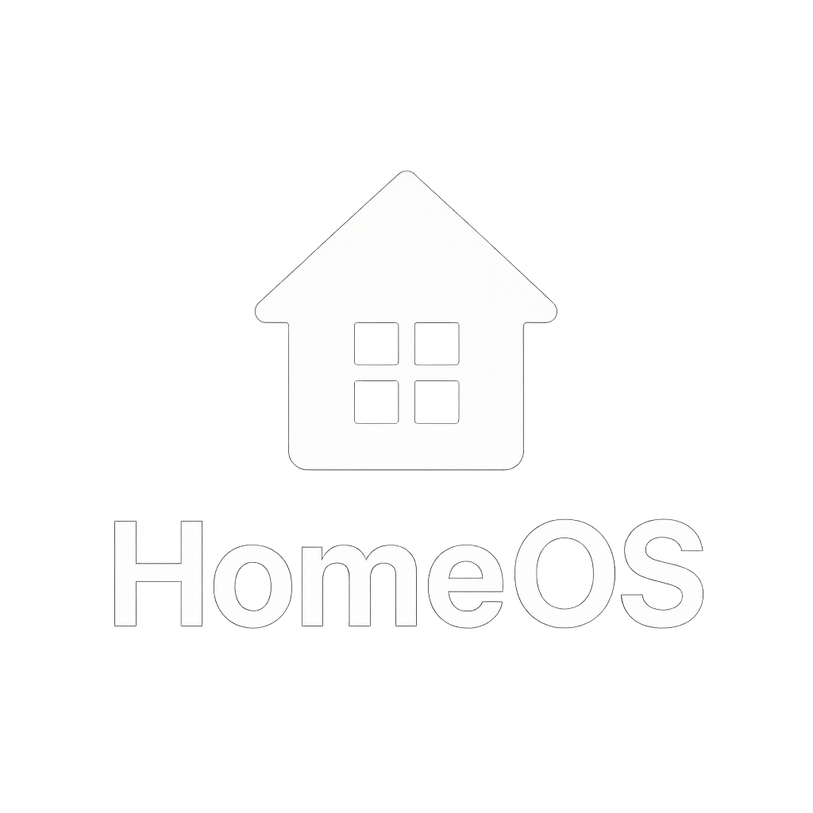

# HolmesOS

**Your Personal Smart Home Detective** 🕵️‍♂️

HolmesOS is an intelligent home management system that brings together all aspects of your smart home into one beautiful, unified interface. Built with modern web technologies and designed for the tech-savvy homeowner who wants complete control over their digital domain.



## 🏠 Features

### 🌐 **Network Monitoring**
- **TP-Link ER605 Router Integration**: Real-time network monitoring and device management
- **Connected Device Tracking**: Monitor all devices on your network with bandwidth usage
- **Security Monitoring**: Track intrusion attempts and security events
- **Device Control**: Block/unblock devices and set bandwidth limits

### ⚡ **Energy Management**
- **Emporia Vue Integration**: Real-time energy monitoring and usage analytics
- **Generator Monitoring**: Modbus integration for backup generator status
- **Usage Analytics**: Track energy consumption patterns and costs
- **Smart Alerts**: Get notified of unusual energy usage

### 📅 **Calendar Integration**
- **Multi-Platform Sync**: Google Calendar, Microsoft Outlook, and Apple Calendar
- **Smart Scheduling**: Intelligent event management and reminders
- **Family Coordination**: Shared calendars for household management

### 📦 **Package Tracking**
- **Multi-Carrier Support**: Track packages from all major carriers
- **Delivery Notifications**: Real-time updates on package status
- **Smart Delivery Management**: Coordinate deliveries and manage expectations

### ✅ **Chore Management**
- **Task Assignment**: Assign and track household chores
- **Progress Tracking**: Monitor completion status and recurring tasks
- **Family Coordination**: Shared responsibility management

### 🛒 **Grocery Management**
- **Smart Shopping Lists**: AI-powered grocery list management
- **Recipe Integration**: Generate shopping lists from recipes
- **Inventory Tracking**: Keep track of pantry items and expiration dates

### 🎵 **Music Control**
- **Spotify Integration**: Control your music from the dashboard
- **Multi-Room Audio**: Manage speakers throughout your home
- **Smart Playlists**: Context-aware music recommendations

### 🌤️ **Weather Intelligence**
- **Real-Time Weather**: Current conditions and detailed forecasts
- **Astronomical Data**: Sunrise, sunset, and moon phase information
- **Weather Effects**: Beautiful animated weather visualization
- **Smart Notifications**: Weather-based alerts and recommendations

## 🛠️ Technology Stack

### **Frontend**
- **React 18** with TypeScript for type-safe development
- **Vite** for lightning-fast development and building
- **Tailwind CSS** for utility-first styling
- **Framer Motion** for smooth animations and transitions
- **Glass Morphism UI** with custom glass components

### **Backend**
- **Node.js** with Express.js for robust API development
- **TypeScript** for full-stack type safety
- **SQLite** for local data storage
- **Modbus TCP** for industrial device communication

### **Integrations**
- **TP-Link ER605** router management
- **Emporia Vue** energy monitoring
- **Google/Microsoft/Apple** calendar sync
- **Spotify** music control
- **OpenWeather** API for weather data
- **SunCalc** for astronomical calculations

## 🚀 Quick Start

### Prerequisites
- Node.js 18+
- npm or yarn
- TP-Link ER605 router (for network monitoring)
- Emporia Vue device (for energy monitoring)

### Installation

1. **Clone the repository**
   ```bash
   git clone https://github.com/BlaineHolmes/HomeOS.git
   cd HomeOS
   ```

2. **Install dependencies**
   ```bash
   npm install
   ```

3. **Configure environment**
   ```bash
   cp .env.example .env
   # Edit .env with your specific configuration
   ```

4. **Start development server**
   ```bash
   npm run dev
   ```

5. **Start backend server**
   ```bash
   npm run server
   ```

6. **Open your browser**
   ```
   http://localhost:5173
   ```

## ⚙️ Configuration

### Router Setup (TP-Link ER605)
```bash
ROUTER_HOST=192.168.1.1
ROUTER_USERNAME=admin
ROUTER_PASSWORD=your-router-password
```

### Energy Monitoring (Emporia Vue)
```bash
EMPORIA_USERNAME=your-emporia-username
EMPORIA_PASSWORD=your-emporia-password
```

### Calendar Integration
```bash
GOOGLE_CLIENT_ID=your-google-client-id
GOOGLE_CLIENT_SECRET=your-google-client-secret
MICROSOFT_CLIENT_ID=your-microsoft-client-id
MICROSOFT_CLIENT_SECRET=your-microsoft-client-secret
```

### Weather API
```bash
WEATHER_API_KEY=your-openweather-api-key
WEATHER_LOCATION=your-city-name
```

## 📱 Screenshots

*Coming soon - the interface is too beautiful to capture in static images!*

## 🔧 Development

### Project Structure
```
HomeOS/
├── src/
│   ├── components/     # Reusable UI components
│   ├── pages/         # Main application pages
│   ├── hooks/         # Custom React hooks
│   ├── contexts/      # React context providers
│   ├── logo/          # HolmesOS branding assets
│   └── types/         # TypeScript type definitions
├── server/
│   ├── routes/        # API route handlers
│   ├── services/      # Business logic services
│   └── middleware/    # Express middleware
├── docs/              # Documentation
└── public/            # Static assets
```

### Available Scripts
- `npm run dev` - Start development server
- `npm run build` - Build for production
- `npm run server` - Start backend server
- `npm run lint` - Run ESLint
- `npm run type-check` - Run TypeScript checks

## 🤝 Contributing

HolmesOS is a personal project, but suggestions and feedback are welcome! Feel free to:

1. Open an issue for bug reports or feature requests
2. Submit pull requests for improvements
3. Share your own smart home integration ideas

## 📄 License

This project is licensed under the MIT License - see the [LICENSE](LICENSE) file for details.

## 👨‍💻 Author

**Jacob Holmes** - *Creator & Lead Developer*
- Email: jacob.holmes@sagafiber.com
- GitHub: [@BlaineHolmes](https://github.com/BlaineHolmes)

## 🙏 Acknowledgments

- Built with love for the smart home community
- Inspired by the need for unified home management
- Special thanks to the open-source community for amazing tools and libraries

---

**HolmesOS v1.0.0** - *Your Personal Smart Home Detective* 🕵️‍♂️✨
